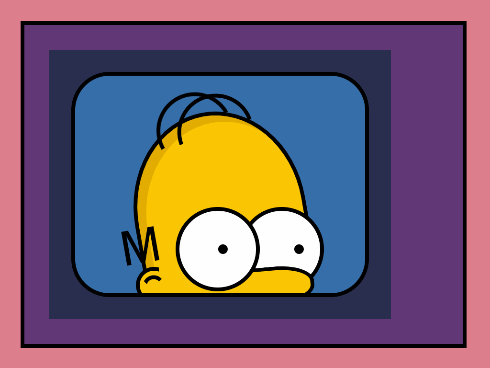

# Simpsons Exercise

## Rules

**This is a pure CSS exercise**

You can ONLY write CSS within the pre-defined styled component string literals to achieve our output.

To be clear, the spirit of the exercise means that you cannot:

- edit any React components - be it adding, removing, or reordering
- edit any styled component `attrs` - be it adding, removing, or editing
- add or edit any assets (images, fonts, etc), either as files or encoded strings

---

## End goal

  
Homer appears inside the television with the wall backdrop.

  
  

### Bonus interactions/animations

  
Homer's eyes shift constantly from left to right

  
  

  
When you hover over one of Homer's eyes, it becomes sleepy

  
  

  
When you hover over the TV screen, the picture turns to black and white

  
  

### Easter egg

  
When you tab to the TV screen, the titles appear to zoom in

  
  

---

## Instructions

- Ink lines are 8px thick black
- Each component contains a comment with useful hex colours
- Some tests contain tips about dimensions and positions, to save you time measuring the snapshot images
- If a test fails, check `__image_snapshots__/__diff_output__` for an image diffing your visual output

### Part 1 - Set up the wall and television

Get all each `step*` test passing within the `part1` folder, following them sequentially.

Note that each previous step test will fail as you move onto the next one - so test one at a time then move on.

### Easter egg

The `easter-egg` test can be tackled now, or later once you've completed some or all of the remaining parts. It's up to you.

### Parts 2, 3 and 4 - Build Homer

Tackle parts, 2, 3 and 4 sequentially, getting all the tests passing within each `part*` folder.

The `bonus` for each part should be done last, but you can tackle the other tests in any order.
